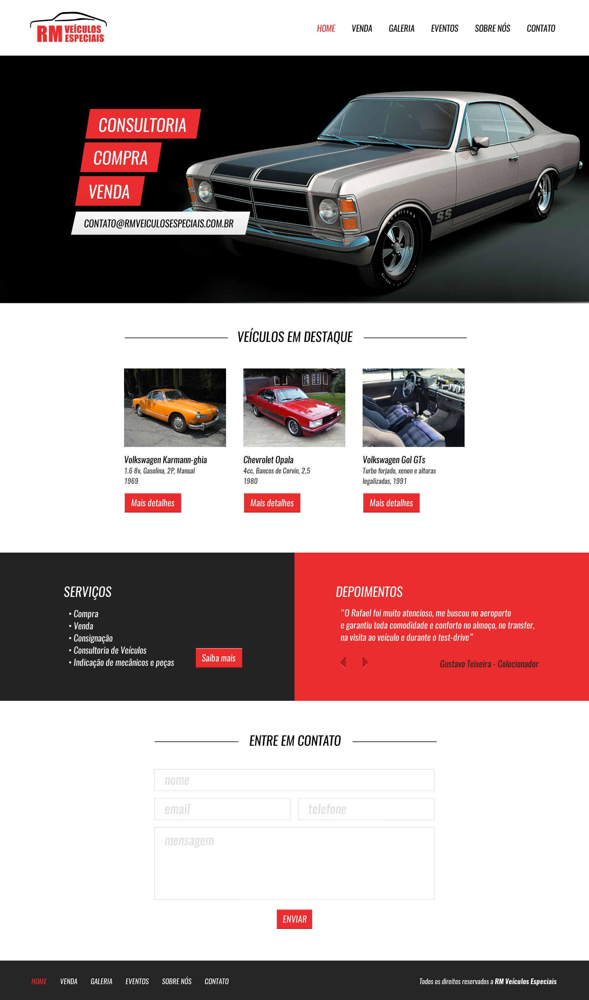
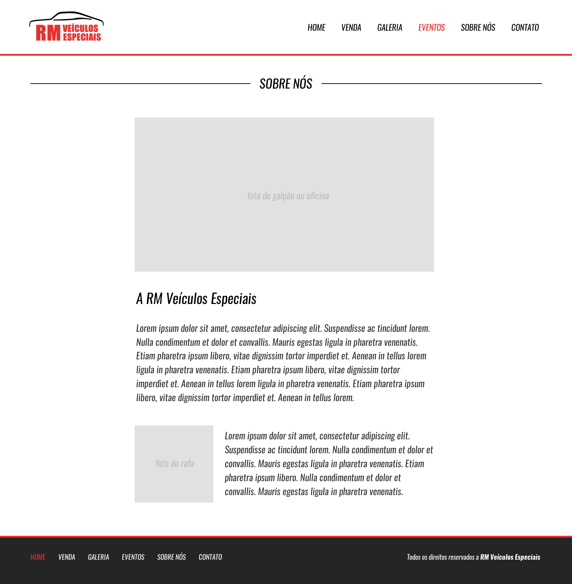

# RM_Carros
## Site de venda de carros 

### Pré Visu 1

### Pré visu 2


# HTML (*Index*) :
```
<!DOCTYPE html>
<html lang="pt-BR">
<head>
    <meta charset="UTF-8">
    <meta name="viewport" content="width=device-width, initial-scale=1.0">
    <meta name="description" content="RMCARROS: Sua Concessionária de Confiança para Veículos Novos e Usados. Descubra uma ampla seleção de carros de qualidade, desde os modelos mais recentes até veículos usados ​​com garantia. Oferecemos opções de financiamento flexíveis e suporte especializado para ajudá-lo a encontrar o veículo dos seus sonhos. Visite-nos hoje e experimente o melhor em automóveis e atendimento ao cliente em sua região.">
    <meta name="author" content="Elon Musk">
    <meta name="keywords" content="Carros Novos, Carros Usados, Concessionária de Veículos, Compra de Carros, Venda de Carros, Veículos Seminovos, Financiamento de Automóveis, Serviço de Manutenção de Carros, Melhor Concessionária de Carros, Ofertas de Carros, Automóveis de Qualidade, Revenda Autorizada, Concessionária de Carros Multimarcas, Test Drive, Troca de Veículos, Consultoria de Compra de Carros, Veículos com Garantia, Carros Esportivos, Sedans de Luxo, SUVs Familiares.">
    <title>RM - Veiculos Automotivos</title>
    <link rel="stylesheet" href="css/style.css">
    <link href="https://fonts.googleapis.com/css?family=Oswald" rel="stylesheet">
    <link rel="stylesheet" href="https://cdn.jsdelivr.net/npm/bootstrap-icons@1.11.0/font/bootstrap-icons.css">
</head>
<body>
    
    <header>
        <div class="container">
        <div class="logo-img"></div><!--logo-img-->

        <nav class="desktop">
            <ul>
            <li><a href="#">Home</a></li>
            <li><a href="venda.html">Venda</a></li>
            <li><a href="sobre.html">Sobre</a></li>
            <li><a href="#">Contato</a></li>
        </ul>
        </nav><!--menu-desktop-->

        <nav class="mobile">
            <ul>
                <li><a href="venda.html">Home</a></li>
                <li><a href="#">Venda</a></li>
                <li><a href="#">Sobre</a></li>
                <li><a href="#">Contato</a></li>
            </ul>
        </nav>

        <div class="clear"></div><!--clear-->
    </div><!--container-->

    </header>

    <section class="banner">
        <div class="container">
        <div class="text-banner">
            <div class="text-banner-single">Consultoria</div><!--text-banner-single-->
            <div class="text-banner-single">Compra</div><!--text-banner-single-->
            <div class="text-banner-single">Venda</div><!--text-banner-single-->
            <div class="text-banner-single">agu@ecuse.no</div><!--text-banner-single-->
        </div><!--text-banner-->
    </div><!--container-->
    </section><!--banner-->

    <section class="veiculos-destaque">
        <div class="line-titulo">
            <div class="ln1"></div><!--ln1-->
        <h2>Veículos em destaque</h2>
    </div><!--line-titulo-->
    <div class="container">

    <div class="vitrine-destaque">
        <div class="carro-img"></div><!--carro-img-->
         <div class="info-carro">
            <h2>Floyd Sherman</h2>
            <p>Annie Weber Lester Wells</p>
            <a class="btn1" href="#">Mais Detalhes</a>
         </div><!--info-carro-->
    </div><!--vitrine-destaque-->

    <div class="vitrine-destaque">
        <div class="carro-img"></div><!--carro-img-->
         <div class="info-carro">
            <h2>Floyd Sherman</h2>
            <p>Annie Weber Lester Wells</p>
            <a class="btn1" href="#">Mais Detalhes</a>
         </div><!--info-carro-->
    </div><!--vitrine-destaque-->
    
    <div class="vitrine-destaque">
        <div class="carro-img"></div><!--carro-img-->
         <div class="info-carro">
            <h2>Floyd Sherman</h2>
            <p>Annie Weber Lester Wells</p>
            <a class="btn1" href="#">Mais Detalhes</a>
         </div><!--info-carro-->
    </div><!--vitrine-destaque-->
    <div class="clear"></div><!--clear-->
    

</div><!--container-->
    </section><!--veiculos-destaque-->

    <section class="servicos-descricao">
        <div class="half1">
            <div class="half1-wraper">
            <h2>Serviços</h2>
            <ul>
                <li>Compra</li>
                <li>Venda</li>
                <li>Consultoria</li>
                <li>Teste Drive</li>
                <li>Indicacão de mecânicos e peças</li>
            </ul>
            <a class="btn1" href="#">Saiba Mais</a>
        </div><!--half1-wraper-->
        </div><!--half1-->

        <div class="half2">
            <h2>Depoimentos</h2>
            <div class="depoimentos-single">
                <p><q>Lorem ipsum dolor sit amet consectetur adipisicing elit. Blanditiis tempore ullam deleniti voluptatum dignissimos aliquid alias, corrupti similique iste harum.</q></p>
                <div class="navigation">
                    <div class="arrows">
                        <i class="bi bi-caret-left-fill"></i>
                        <i class="bi bi-caret-right-fill"></i>
                    </div><!--arrows-->
                    <div class="nome-depoimento">Violet Horton</div><!--nome-depoimento-->
                </div><!--navigation-->
            </div><!--depoimentos-single-->
        </div><!--half2-->
    </section><!--servicos-descricao-->

    <section class="contato">
        <div class="container">
        <div class="line-titulo">
            <div class="ln1"></div><!--ln1-->
        <h2>Contato</h2>
    </div><!--line-titulo-->

    <form action="">

        <div class="input-wraper w100">
            <input placeholder="Nome*" type="text" name="" id="" required>
        </div><!--input-wraper w100-->

        <div class="input-wraper w50">
            <input placeholder="E-mail*" type="email" name="" id="" required>
        </div><!--input-wraper w50-->

        <div class="input-wraper w50">
            
            <input placeholder="Telefone*" type="tel" name="" id="" required>
        </div><!--input-wraper w50-->
        
        <div class="input-wraper w100">
            <textarea placeholder="Mensagem*" name="msg" id="msg" cols="30" rows="10" required></textarea>
        </div><!--input-wraper w100-->

        <div class="input-wraper w100">
            <input class="btn2" type="submit" value="Enviar">
        </div><!--input-wraper w100-->
        <div class="clear"></div><!--clear-->
    </form>

</div><!--container-->

    </section><!--contato-->

    <footer>
        <div class="container">
         
        <nav>
            <ul>
            <li><a href="#">Home</a></li>
            <li><a href="venda.html">Venda</a></li>
            <li><a href="sobre.html">Sobre</a></li>
            <li><a href="#">Contato</a></li>
        </ul>
        </nav>
        <p>Todos os direitos reservados</p>   
        <div class="clear"></div><!--clear-->
        </div><!--container-->
    </footer>

</body>
</html>
```
# HTML (*mais-detalhes*) :

```
<!DOCTYPE html>
<html lang="pt-BR">
<head>
    <meta charset="UTF-8">
    <meta name="viewport" content="width=device-width, initial-scale=1.0">
    <meta name="description" content="RMCARROS: Sua Concessionária de Confiança para Veículos Novos e Usados. Descubra uma ampla seleção de carros de qualidade, desde os modelos mais recentes até veículos usados ​​com garantia. Oferecemos opções de financiamento flexíveis e suporte especializado para ajudá-lo a encontrar o veículo dos seus sonhos. Visite-nos hoje e experimente o melhor em automóveis e atendimento ao cliente em sua região.">
    <meta name="author" content="Elon Musk">
    <meta name="keywords" content="Carros Novos, Carros Usados, Concessionária de Veículos, Compra de Carros, Venda de Carros, Veículos Seminovos, Financiamento de Automóveis, Serviço de Manutenção de Carros, Melhor Concessionária de Carros, Ofertas de Carros, Automóveis de Qualidade, Revenda Autorizada, Concessionária de Carros Multimarcas, Test Drive, Troca de Veículos, Consultoria de Compra de Carros, Veículos com Garantia, Carros Esportivos, Sedans de Luxo, SUVs Familiares.">
    <title>RM - Veiculos Automotivos</title>
    <link rel="stylesheet" href="css/style.css">
    <link href="https://fonts.googleapis.com/css?family=Oswald" rel="stylesheet">
    <link rel="stylesheet" href="https://cdn.jsdelivr.net/npm/bootstrap-icons@1.11.0/font/bootstrap-icons.css">
</head>
<body>
    
    <header style="border-bottom: 3px solid #EB2D2D;">
        <div class="container">
        <div class="logo-img"></div><!--logo-img-->

        <nav class="desktop">
            <ul>
            <li><a style="color: #000000;" href="index.html">Home</a></li>
            <li><a style="color: #EB2D2D;" href="venda.html">Venda</a></li>
            <li><a href="sobre.html">Sobre</a></li>
            <li><a href="#">Contato</a></li>
        </ul>
        </nav><!--menu-desktop-->

        <nav class="mobile">
            <ul>
                <li><a href="#">Home</a></li>
                <li><a href="#">Venda</a></li>
                <li><a href="#">Sobre</a></li>
                <li><a href="#">Contato</a></li>
            </ul>
        </nav>

        <div class="clear"></div><!--clear-->
    </div><!--container-->

    </header>

    <section class="venda-single">

        <div class="line-titulo">
            <div class="ln1"></div>
            <h2>Veiculo para venda</h2>
        </div><!--line-titulo-->

        <div class="container alin">
    
        <div class="info-veiculo">
            <div class="info-bread"><a href="index.html">Home</a><span> &gt;</span>
                <a href="venda.html">Venda</a><span> &gt;</span>
                <a href="#">Veículo</a></div><!--info-bread-->
            <div class="foto-destaque"></div><!--foto-destaque-->
            <div class="nav-galeria">
                <div class="nav-galeria-wraper">
                <div class="mini-img mini-img-wraper"></div><!--mini-img--><!--mini-img-wraper-->
                <div class="mini-img mini-img-wraper"></div><!--mini-img--><!--mini-img-wraper-->
                <div class="mini-img mini-img-wraper"></div><!--mini-img--><!--mini-img-wraper-->
                <div class="mini-img mini-img-wraper"></div><!--mini-img--><!--mini-img-wraper-->
                <div class="mini-img mini-img-wraper"></div><!--mini-img--><!--mini-img-wraper-->
                <div class="mini-img mini-img-wraper"></div><!--mini-img--><!--mini-img-wraper-->
            </div><!--nav-galeria-wraper-->
            </div><!--nav-galeria-->
        </div><!--info-veiculo-->
    
        <div class="descricao-veiculo">
            <h1>R$ 77.454,99</h1>
            <p>Lorem ipsum dolor sit amet consectetur adipisicing elit. Ad corrupti aut rem esse tempora doloribus. Fuga pariatur fugiat unde quam nemo. Excepturi rerum doloribus nulla ad sint! Nobis, adipisci sapiente.</p>
            <a href="#" class="btn2">Entre em contato</a>
        </div><!--descricao-veiculo-->
        <div class="clear"></div><!--clear-->
    </div><!--container-->
    
        </section><!--venda-single-->

        <section class="contato">
            <div class="line-titulo">
                <div class="ln1"></div>
                <h2>Contato</h2>
            </div><!--line-titulo-->

    <form action="">

        <div class="input-wraper w100">
            <input placeholder="Nome*" type="text" name="" id="" required>
        </div><!--input-wraper w100-->

        <div class="input-wraper w50">
            <input placeholder="E-mail*" type="email" name="" id="" required>
        </div><!--input-wraper w50-->

        <div class="input-wraper w50">
            
            <input placeholder="Telefone*" type="tel" name="" id="" required>
        </div><!--input-wraper w50-->
        
        <div class="input-wraper w100">
            <textarea placeholder="Mensagem*" name="msg" id="msg" cols="30" rows="10" required></textarea>
        </div><!--input-wraper w100-->

        <div class="input-wraper w100">
            <input class="btn2" type="submit" value="Enviar">
        </div><!--input-wraper w100-->
        <div class="clear"></div><!--clear-->
    </form>

    </section><!--contato-->
    
        <section class="veiculos-destaque">
            <div class="line-titulo">
                <div class="ln1"></div><!--ln1-->
            <h2>Veículos em destaque</h2>
        </div><!--line-titulo-->
        <div class="container">
    
        <div class="vitrine-destaque">
            <div class="carro-img"></div><!--carro-img-->
             <div class="info-carro">
                <h2>Floyd Sherman</h2>
                <p>Annie Weber Lester Wells</p>
                <a class="btn1" href="#">Mais Detalhes</a>
             </div><!--info-carro-->
        </div><!--vitrine-destaque-->
    
        <div class="vitrine-destaque">
            <div class="carro-img"></div><!--carro-img-->
             <div class="info-carro">
                <h2>Floyd Sherman</h2>
                <p>Annie Weber Lester Wells</p>
                <a class="btn1" href="#">Mais Detalhes</a>
             </div><!--info-carro-->
        </div><!--vitrine-destaque-->
        
        <div class="vitrine-destaque">
            <div class="carro-img"></div><!--carro-img-->
             <div class="info-carro">
                <h2>Floyd Sherman</h2>
                <p>Annie Weber Lester Wells</p>
                <a class="btn1" href="#">Mais Detalhes</a>
             </div><!--info-carro-->
        </div><!--vitrine-destaque-->
        <div class="clear"></div><!--clear-->
            
    </div><!--container-->
        </section><!--veiculos-destaque-->

    <footer>
        <div class="container">
         
        <nav>
            <ul>
            <li><a style="color: #FFFFFF;" href="index.html">Home</a></li>
            <li><a style="color: #EB2D2D;" href="venda.html">Venda</a></li>
            <li><a href="sobre.html">Sobre</a></li>
            <li><a href="#">Contato</a></li>
        </ul>
        </nav>
        <p>Todos os direitos reservados</p>   
        <div class="clear"></div><!--clear-->
        </div><!--container-->
    </footer>

</body>
</html>

```

# HTML (*sobre*) :

```
<!DOCTYPE html>
<html lang="pt-BR">
<head>
    <meta charset="UTF-8">
    <meta name="viewport" content="width=device-width, initial-scale=1.0">
    <meta name="description" content="RMCARROS: Sua Concessionária de Confiança para Veículos Novos e Usados. Descubra uma ampla seleção de carros de qualidade, desde os modelos mais recentes até veículos usados ​​com garantia. Oferecemos opções de financiamento flexíveis e suporte especializado para ajudá-lo a encontrar o veículo dos seus sonhos. Visite-nos hoje e experimente o melhor em automóveis e atendimento ao cliente em sua região.">
    <meta name="author" content="Elon Musk">
    <meta name="keywords" content="Carros Novos, Carros Usados, Concessionária de Veículos, Compra de Carros, Venda de Carros, Veículos Seminovos, Financiamento de Automóveis, Serviço de Manutenção de Carros, Melhor Concessionária de Carros, Ofertas de Carros, Automóveis de Qualidade, Revenda Autorizada, Concessionária de Carros Multimarcas, Test Drive, Troca de Veículos, Consultoria de Compra de Carros, Veículos com Garantia, Carros Esportivos, Sedans de Luxo, SUVs Familiares.">
    <title>RM - Venda</title>
    <link rel="stylesheet" href="css/style.css">
    <link href="https://fonts.googleapis.com/css?family=Oswald" rel="stylesheet">
    <link rel="stylesheet" href="https://cdn.jsdelivr.net/npm/bootstrap-icons@1.11.0/font/bootstrap-icons.css">
</head>
<body>
    
    <header style="border-bottom: 3px solid #EB2D2D;">
        <div class="container">
        <div class="logo-img"></div><!--logo-img-->

        <nav class="desktop">
            <ul>
            <li><a style="color: #000000;" href="index.html">Home</a></li>
            <li><a style="color: #000000;" href="venda.html">Venda</a></li>
            <li><a style="color: #EB2D2D;" href="#">Sobre</a></li>
            <li><a href="#">Contato</a></li>
        </ul>
        </nav><!--menu-desktop-->

        <nav class="mobile">
            <ul>
                <li><a href="index.html" class="select2">Home</a></li>
                <li><a href="venda.html" class="select">Venda</a></li>
                <li><a href="#">Sobre</a></li>
                <li><a href="#">Contato</a></li>
            </ul>
        </nav>

        <div class="clear"></div><!--clear-->
    </div><!--container-->

    </header>

    <section class="sobre">

            <div class="line-titulo">
                <div class="ln1"></div>
                <h2>Veiculo para venda</h2>
            </div><!--line-titulo-->

            <div class="container">
                <div class="img-destaque-sobre"></div><!--img-destaque-sobre-->
                <div class="descricao-autor">
                    <h2>Julian Carr</h2>
                    <p>Lorem ipsum dolor, sit amet consectetur adipisicing elit. Totam molestias est nisi vel amet, autem ut ipsa! Esse maiores commodi nobis quis optio exercitationem quam porro, recusandae, a, laudantium aliquam illum neque. Commodi accusantium nesciunt accusamus tenetur! Qui neque error, in officia quaerat ullam sequi itaque accusamus temporibus aut corrupti saepe tempore. Minus labore unde blanditiis, illo eos delectus perspiciatis quibusdam in iusto laudantium nihil omnis? Repellendus perferendis sit dolorum.</p>
                </div><!--descricao-autor-->
                <div class="descricao-autor2">
                    <div class="img-small"></div><!--img-small-->
                    <p><q>
                        Lorem ipsum, dolor sit amet consectetur adipisicing elit. Provident distinctio placeat quae ut possimus odio officia asperiores laborum ducimus, dignissimos, atque at, quidem repellendus aperiam in. Odit, inventore quisquam asperiores corrupti veritatis repellendus, eveniet, ab eligendi eos recusandae sint aperiam facilis. Sint libero totam nihil, ipsum quia aut eius eum aperiam, alias earum corporis adipisci.</q>
                    </p>
                </div><!--descricao-autor2-->
            </div><!--container-->

        <div class="clear"></div><!--clear-->
    </section><!--sobre-->

    <footer>
        <div class="container">
         
        <nav>
                <ul>
                <li><a style="color: #FFFFFF;" href="index.html">Home</a></li>
                <li><a style="color: #FFFFFF;" href="venda.html">Venda</a></li>
                <li><a style="color: #EB2D2D;"  href="sobre.html">Sobre</a></li>
                <li><a href="#">Contato</a></li>
            </ul>
        </nav>
        <p>Todos os direitos reservados</p>   
        <div class="clear"></div><!--clear-->
        </div><!--container-->
    </footer>
    


</body>
</html>
```

# HTML (*venda*) :
```
<!DOCTYPE html>
<html lang="pt-BR">
<head>
    <meta charset="UTF-8">
    <meta name="viewport" content="width=device-width, initial-scale=1.0">
    <meta name="description" content="RMCARROS: Sua Concessionária de Confiança para Veículos Novos e Usados. Descubra uma ampla seleção de carros de qualidade, desde os modelos mais recentes até veículos usados ​​com garantia. Oferecemos opções de financiamento flexíveis e suporte especializado para ajudá-lo a encontrar o veículo dos seus sonhos. Visite-nos hoje e experimente o melhor em automóveis e atendimento ao cliente em sua região.">
    <meta name="author" content="Elon Musk">
    <meta name="keywords" content="Carros Novos, Carros Usados, Concessionária de Veículos, Compra de Carros, Venda de Carros, Veículos Seminovos, Financiamento de Automóveis, Serviço de Manutenção de Carros, Melhor Concessionária de Carros, Ofertas de Carros, Automóveis de Qualidade, Revenda Autorizada, Concessionária de Carros Multimarcas, Test Drive, Troca de Veículos, Consultoria de Compra de Carros, Veículos com Garantia, Carros Esportivos, Sedans de Luxo, SUVs Familiares.">
    <title>RM - Venda</title>
    <link rel="stylesheet" href="css/style.css">
    <link href="https://fonts.googleapis.com/css?family=Oswald" rel="stylesheet">
    <link rel="stylesheet" href="https://cdn.jsdelivr.net/npm/bootstrap-icons@1.11.0/font/bootstrap-icons.css">
</head>
<body>
    
    <header style="border-bottom: 3px solid #EB2D2D;">
        <div class="container">
        <div class="logo-img"></div><!--logo-img-->

        <nav class="desktop">
            <ul>
            <li><a href="index.html" class="select2">Home</a></li>
            <li><a href="venda.html" class="select">Venda</a></li>
            <li><a href="sobre.html">Sobre</a></li>
            <li><a href="#">Contato</a></li>
        </ul>
        </nav><!--menu-desktop-->

        <nav class="mobile">
            <ul>
                <li><a href="index.html" class="select2">Home</a></li>
                <li><a href="venda.html" class="select">Venda</a></li>
                <li><a href="#">Sobre</a></li>
                <li><a href="#">Contato</a></li>
            </ul>
        </nav>

        <div class="clear"></div><!--clear-->
    </div><!--container-->

    </header>

    <section class="venda">
        <div class="line-titulo">
            <div class="ln1"></div><!--ln1-->
        <h2>Venda</h2>
    </div><!--line-titulo-->

    <div class="content-venda">
        <div class="container">
        <div class="sidebar">
            <div class="search1"><h1>Filtre por preço</h1>
                <input type="range" name="barra" id="barra">
                <div class="valor-pesquisa">
                <p>R$ 0,0</p>
                <p>R$ 70.000,00</p>
                <div class="clear"></div><!--clear-->
            </div><!--valor-pesquisa-->
            </div><!--search1-->

            <div class="search2">
                <h2>Filtre agora por ano</h2>
                <form action="">

                    <div class="form-venda-wraper">
                    <input type="checkbox" name="it" id="item1">
                    <label for="item1" >
                        <div class="circle"></div><!--cicle-->
                    </label>
                    <span>2000 - 2009</span>
                </div><!--form-venda-wraper-->

                <div class="form-venda-wraper">
                    <input type="checkbox" name="it" id="item2">
                    <label for="item2" >
                        <div class="circle"></div><!--cicle-->
                    </label>
                    <span>1990 - 2000</span>
                </div><!--form-venda-wraper-->
                
                <div class="form-venda-wraper">
                    <input type="checkbox" name="it" id="item3">
                    <label for="item3" >
                        <div class="circle"></div><!--cicle-->
                    </label>
                    <span>1800 - 1980</span>
                </div><!--form-venda-wraper-->
                
                <div class="form-venda-wraper">
                    <input type="checkbox" name="it" id="item4">
                    <label for="item4" >
                        <div class="circle"></div><!--cicle-->
                    </label>
                    <span>1300 - 1500</span>
                </div><!--form-venda-wraper-->
                
                <div class="form-venda-wraper">
                    <input type="checkbox" name="it" id="item5">
                    <label for="item5" >
                        <div class="circle"></div><!--cicle-->
                    </label>
                    <span>2010 - 2013</span>
                </div><!--form-venda-wraper-->
                
                <div class="form-venda-wraper">
                    <input type="checkbox" name="it" id="item6">
                    <label for="item6" >
                        <div class="circle"></div><!--cicle-->
                    </label>
                    <span>2012 - 2023</span>
                </div><!--form-venda-wraper-->
                

                </form>
            </div><!--search2-->

        </div><!--sidebar-->

        <div class="vitrine-venda">

        <section class="veiculos-destaque">


        <div class="vitrine-destaque">
            <div class="carro-img"></div><!--carro-img-->
             <div class="info-carro">
                <h2>Floyd Sherman</h2>
                <p>Annie Weber Lester Wells</p>
                <a class="btn1" href="mais-detalhes.html">Mais Detalhes</a>
             </div><!--info-carro-->
        </div><!--vitrine-destaque-->
    
        <div class="vitrine-destaque">
            <div class="carro-img"></div><!--carro-img-->
             <div class="info-carro">
                <h2>Floyd Sherman</h2>
                <p>Annie Weber Lester Wells</p>
                <a class="btn1" href="#">Mais Detalhes</a>
             </div><!--info-carro-->
        </div><!--vitrine-destaque-->
        
        <div class="vitrine-destaque">
            <div class="carro-img"></div><!--carro-img-->
             <div class="info-carro">
                <h2>Floyd Sherman</h2>
                <p>Annie Weber Lester Wells</p>
                <a class="btn1" href="#">Mais Detalhes</a>
             </div><!--info-carro-->
        </div><!--vitrine-destaque-->


        <section class="veiculos-destaque">

            <div class="vitrine-destaque">
                <div class="carro-img"></div><!--carro-img-->
                 <div class="info-carro">
                    <h2>Floyd Sherman</h2>
                    <p>Annie Weber Lester Wells</p>
                    <a class="btn1" href="#">Mais Detalhes</a>
                 </div><!--info-carro-->
            </div><!--vitrine-destaque-->
        
            <div class="vitrine-destaque">
                <div class="carro-img"></div><!--carro-img-->
                 <div class="info-carro">
                    <h2>Floyd Sherman</h2>
                    <p>Annie Weber Lester Wells</p>
                    <a class="btn1" href="#">Mais Detalhes</a>
                 </div><!--info-carro-->
            </div><!--vitrine-destaque-->
            
            <div class="vitrine-destaque">
                <div class="carro-img"></div><!--carro-img-->
                 <div class="info-carro">
                    <h2>Floyd Sherman</h2>
                    <p>Annie Weber Lester Wells</p>
                    <a class="btn1" href="#">Mais Detalhes</a>
                 </div><!--info-carro-->
            </div><!--vitrine-destaque-->


    </div><!--vitrine-venda-->
        <div class="clear"></div><!--clear-->
    </div><!--container-->
        
    </div><!--content-venda-->

    </section><!--venda-->


    <footer>
        <div class="container">
         
        <nav>
            <ul>
            <li><a href="index.html" class="select3">Home</a></li>
            <li><a href="venda.html" class="select">Venda</a></li>
            <li><a href="sobre.html">Sobre</a></li>
            <li><a href="#">Contato</a></li>
        </ul>
        </nav>
        <p>Todos os direitos reservados</p>   
        <div class="clear"></div><!--clear-->
        </div><!--container-->
    </footer>
    


</body>
</html>
```

# CSS:
```
/*Base inicial de documento css(reset/formatação/var's)*/
*{
    padding: 0;
    margin: 0;
    box-sizing: border-box;
    text-shadow: 4px 4px 7px rgba(0,0,0,0.20) !important;
    font-family: var(--font_Oswald);
    resize: none;
}
html,body{
    height: 100%;
}
a{
    text-decoration: none;
}
:root{
    --black: #000000;
    --font_Oswald: 'Oswald', sans-serif;
    --TextWhite: #FFFFFF;
}
.container{
    width: 100%;
    max-width: 1280px;
    margin: 0 auto;
}
.clear{clear: both;}
/*Header*/
.logo-img{
    width: 208px;
    height: 82px;
    background-image: url("../img/logo.jpg");
    background-position: center 100%;
    background-repeat: no-repeat;
    background-size: 100% 100%;   
}
header{
    padding: 20px 2% 35px 2%;
    height: 130px;
    font-weight: var(--bold);
    font-style: italic;
}
/*Menu header*/
header div.logo-img{
    float: left;
}
header nav.desktop{
    float: right;
    position: relative;
    top: 35px;
}
header nav.desktop ul{
    list-style-type: none;
}
header nav.desktop ul li{
    float: left;
    font-size: 23px;
    padding: 0 30px;
}
header nav.desktop ul li a{
    color: var(--black);
    text-decoration: none !important;
}
header nav.desktop ul li:first-child a{
    color: #EB2D2D;
}
nav.mobile
{
    margin-top: 40px;
    display: none;
    width: 32px;
    height: 32px;
    float: right;
    cursor: pointer;
    background-image: url("../img/icon_menu.png");
    background-size: 100% 100%;
}
nav.mobile ul{
    width: 100%;
    background-color: #fffffff8;
    position: absolute;
    text-align: center;
    left: 0;
    top: 110px;
    z-index: 99;
}
nav.mobile li{
    font-size: 23px;
    padding: 20px 0;
    font-style: italic;
    border: 0.8px solid #EB2D2D;
}
nav.mobile li a{
    color: #000000;
    text-decoration: none !important;
}
/*Banner*/
section.banner{
    overflow: hidden;
    width: 100%;
    height: 600px;
    background-color: var(--black);
    background-image: url("../img/bg.jpg");
    background-position: right bottom;
    background-repeat: no-repeat;
    background-size: contain;
}
.text-banner{
    padding: 100px;
}
.text-banner-single{
	width: 314px;
	font-style: italic;
	margin-top:30px;
	height: 70px;
	line-height: 70px;
	padding-left: 50px;
	text-transform: uppercase;
    font-weight: bold;
	color: var(--TextWhite);
	font-size: 23px;
	background-image: url("../img/box-text.png");
	background-size: 100% 100%;
	background-repeat: no-repeat;
}

.text-banner .text-banner-single:nth-of-type(2){
	width: 200px;
	height: 70px;
	line-height: 70px;
	position: relative;
	left: -10px;
}

.text-banner .text-banner-single:nth-of-type(3){
	width: 170px;
	height: 70px;
	line-height: 70px;
	position: relative;
	left: -20px;
}
.text-banner .text-banner-single:nth-of-type(4){
	width: 320px;
	height: 70px;
    font-size: 21px;
    background-image: url("../img/box-white-text.png");
    background-repeat: no-repeat;
    background-size: 100% 100%;
    color: #000000;
    position: relative;
    left: -30px;
}
section.veiculos-destaque{
    padding: 90px 2%;
}
section.veiculos-destaque .container{
    max-width: 1000px;
    padding: 40px 0;
}
.vitrine-destaque{
     float: left;
     width: 33.3%;
}
.vitrine-destaque .carro-img{
    width: 100%;
    padding-top: 100%;
    background-image: url("../img/carro1.jpg");
    border: 8px solid #FFFFFF;
    background-size: 100% 100%;
}
.vitrine-destaque h2{
    padding-left: 8px;
    color: #000000;
    font-style: italic;
    font-size: 20px;
}
.vitrine-destaque p{
    padding: 8px 0 0 8px;
    color: #353535;
    font-size: 15px;
    font-style: italic;
}
.vitrine-destaque a{
    margin: 10px 0 0 8px;
}
.btn1{
    transition: 0.2s;
    border-bottom: 2px solid transparent;
    box-shadow: 8px 8px 8px -1px rgba(0,0,0,0.28);
    -webkit-box-shadow: 8px 8px 8px -1px rgba(0,0,0,0.28);
    -moz-box-shadow: 8px 8px 8px -1px rgba(0,0,0,0.28);
}
.btn1:hover{
    border-bottom: 2px solid #B21E1E;
    box-shadow: 0px 0px 0px 0px rgba(0,0,0,0);
    -webkit-box-shadow: 0px 0px 0px 0px rgba(0,0,0,0);
    -moz-box-shadow: 0px 0px 0px 0px rgba(0,0,0,0);
}
.line-titulo > h2{
    position: relative;
    background-color: #FFFFFF;
    display: inline-block;
    text-align: center;
    font-size: 27px;
    padding: 0 20px;
    font-style: italic;
    text-transform: uppercase;
}
.line-titulo{
    max-width: 1280px;
    margin: 0 auto;
    position: relative;
    text-align: center;
}
.ln1{
    position: absolute;
    height: 2px;
    top: 20px;
    background-color: #333333;
    width: 100%;
}
.half1{
    width: 50%;
    background-color: #242424;   
    padding: 90px 0; 
    color: #FFFFFF;
    text-align: right;
}
.half1-wraper{
    padding-right: 20%;
    text-align: left;
    display: inline-block;
}
.half1-wraper h2{
    font-weight: normal;
    font-style: italic;
    font-size: 32px;
}
.half1-wraper ul{
    display: inline-block;
    margin-top: 5px;
    list-style-position: inside;
}
.btn1{
    text-align: center;
    display: block;
    line-height: 40px;
    background-color: #EB2D2D;
    text-decoration: none !important;
    border-bottom: 5px solid #B21E1E;
    color: #FFFFFF !important;
    font-size: 16px;
    font-style: italic;
    width: 150px;
}
.half1-wraper a{
    margin: 20px 0 0 40px;
    display: inline-block;
    vertical-align: bottom;
}
.half2{
    width: 50%;
    background-color: #EB2D2D;   
    padding: 90px 100px; 
    color: #FFFFFF;
}
.depoimentos-single q::before{
    content: "\201C  ";
    font-size: 15px;
    color: #e4e4e4;
}
.depoimentos-single q::after{
    content: "\201D";
    font-size: 15px;
    color: #e4e4e4;
}
.half2 h2{
    font-weight: normal;
    font-style: italic;
    font-size: 32px;
}
.half2 .depoimentos-single{
    margin-top: 19px;
}
.depoimentos-single p{
    font-size: 22px;
}
.navigation{
    float: left;
    width: 100%;
    max-width: 400px;
    margin-top: 30px;
}
.navigation i{
    margin: 0 20px;
    cursor: pointer;
    font-size: 25px;
    color: #B21E1E;
}
.arrows{
    float: left;
}
.nome-depoimento{
    float: right;
    color: #252525;
    font-size: 23px;
}
.servicos-descricao{
    display: flex;
}
section.contato .container{
    max-width: 1000px;
    padding: 80px 2% 2%;
}
section.contato form{
    max-width: 600px;
    margin: 30px auto;
}
section.contato .input-wraper{
    float: left;
    padding: 10px;
    margin-top: 7px;
}
section.contato input[type="text"],
section.contato input[type="email"],
section.contato input[type="tel"]{
    width: 100%;
    border: 1px solid #CCCCCC;
    height: 60px;
    font-size: 16px;
    line-height: 40px;
    padding-left: 15px;
}
.w100{
    width: 100%;
}
.w50{
    width: 50%;
}
section.contato textarea{
    width: 100%;
    border: 1px solid #CCCCCC;
    height: 140px;
    font-size: 16px;
    line-height: 40px;
    padding: 8px;
}
section.contato input[type="submit"]{
    border-left: none;
    border-right: none;
    border-top: none;
    cursor: pointer;
    display: inline-block;
}
section.contato form .input-wraper:nth-of-type(5){
    text-align: center;
}
footer nav ul li:first-child a{
    color: #EB2D2D;
}
footer{
    padding: 40px 2%;
    background-color: #252525;
}
footer nav{
    float: left;
}
footer nav ul{
    list-style-type: none;
}
footer nav ul li{
    float: left;
    padding: 0 20px;
    font-style: italic;
    font-size: 19px;
}
footer nav ul a{
    color: #FFFFFF;
}
footer p{
    float: right;
    color: #FFFFFF;
    font-size: 19px;
    font-style: italic;
}
.btn2{
    text-align: center;
    display: block;
    line-height: 40px;
    background-color: #EB2D2D;
    text-decoration: none !important;
    border-bottom: 5px solid #B21E1E;
    color: #FFFFFF !important;
    font-size: 16px;
    font-style: italic;
    width: 150px;
}
.select{
    color: #EB2D2D !important;
}
.select2{
    color: #000000 !important;
}
.select3{
color: #FFFFFF !important;
}
/*Pagina de vndas*/
section.venda{
    min-height: 90%;
    max-width: 1280px;
    margin: 0 auto;
    padding: 90px 0;
}
.sidebar{
    float: left;
    width: 30%;
}
.content-venda{
    margin-top: 40px;
}
.search1 h2{
    font-size: 24px;
    color: #000000;
    font-weight: normal;
}

.search1 input[type="range"]{
    width: 90%;
    margin-top: 8px;
    -webkit-appearance: none;
    appearance: none;
    display: inline-block;
    background-color: #EB2D2D;
    border-radius: 8px;
    outline: none;
    cursor: pointer;
    border: 0.8px solid #CCCCCC;
    background-image: linear-gradient(to bottom,#b12a2a,#EB2d2d);
}
.valor-pesquisa{
    margin-top: 8px;
    width: 300px;
}
.valor-pesquisa p{
    color: #000000;
    font-size: 15px;
}
.valor-pesquisa p:nth-of-type(1){
    float: left;
}
.valor-pesquisa p:nth-of-type(2){
    float: right;
}
.search2{
    margin-top: 40px;
}
.search2 h2{
    font-size: 24px;
    color: #000000;
    font-weight: normal;
}
.form-venda-wraper{
    margin-top: 8px;
}
.form-venda-wraper input{
    display: none;
}
.form-venda-wraper label{
    width: 15px;
    height: 15px;
    border: 1px solid #cccccc65;
    border-radius: 8px;
    display: inline-block;
    cursor: pointer;
    position: relative;
}
.form-venda-wraper input[type="checkbox"]:checked +
 label > .circle{
    display: block;
}
.circle{
    width: 8px;
    height: 8px;
    border-radius: 4px;
    background-color: #EB2D2D;
    position: absolute;
    left: 1.9px;
    top: 1.9px;
    display: none;
}
.form-venda-wraper span{
    vertical-align: top;
    padding: 0 10px;
}
/*Slider Teste*/
.search1 input[type="range"]::-webkit-slider-thumb{
    all: unset;
    -webkit-appearance: none;
    /*Format*/
    background-image: linear-gradient(to bottom,#b12a2a,#EB2d2d);
    border: 0.5px solid #cccccc65;
    width: 25px;
    height: 25px;
}
.search1 input[type="range"]::-ms-range-thumb{
    background-image: linear-gradient(to bottom,#b12a2a,#EB2d2d);
    border: 0.5px solid #cccccc65;
    width: 25px;
    height: 25px;
}
.search1 input[type="range"]::-moz-range-thumb{
    background-image: linear-gradient(to bottom,#b12a2a,#EB2d2d);
    border: 0.5px solid #cccccc65;
    width: 25px;
    height: 25px;
}
/*Vitrine*/
.vitrine-venda{
    float: left;
    width: 70%;
    overflow: hidden;
}
.vitrine-venda .vitrine-destaque{
    margin-top: 20px;
}
section.venda-single{
    padding: 80px 2% 0 2%;
}
section.venda-single .container{
    padding: 80px 0 0 0;
    max-width: 900px;
}
.info-veiculo{
    float: left;
    width: 60%;
}
.descricao-veiculo{
    float: left;
    width: 40%;
    padding: 40px 20px;
}
.descricao-veiculo p{
    max-width: 450px;
    margin: 25px 0 15px 0;
}
.foto-destaque{
    width: 100%;
    padding-top: 70%;
    background-position: center;
    background-size: cover;
    background-repeat: no-repeat;
    background-image: url("../img/carro1.jpg");
}
.info-bread{
    padding: 20px 0;
    text-align: left;
}
.info-bread a{
    color: #000000;
}
.info-bread span{
    padding: 0 15px;
}
.info-bread a:last-child{
    color: #EB2D2D;
}
.nav-galeria{
    width: 100%;
    padding: 15px;
    cursor: pointer;
    margin-top: 15px;
    overflow: scroll;
}
.nav-galeria-wraper{
    width: 210%;
}
.nav-galeria-wraper .mini-img{
    width: calc(33.3% * (100 / 200));
    padding-top: calc(33.3% * (100 / 200) * 0.6);;
    float: left;
    border: 4.8px #FFFFFF solid;
    background-position: center;
    background-size: cover;
    background-repeat: no-repeat;
    background-image: url("../img/carro1.jpg");
}
/*Sobre*/
section.sobre{
    margin: 0 auto;
    max-width: 90%;
    padding: 60px 2% 20px 2%;
}
section.sobre .container{
    max-width: 840px;
    margin-top: 30px;
}
section.sobre .img-destaque-sobre{
    width: 100%;
    padding-top: 60%;
    background-color: rgb(220,220,220);
}
section.sobre .descricao-autor{
    margin-top: 20px;
}
.descricao-autor h2{
    font-size: 24px;
}
.descricao-autor p{
    font-size: 16px;
    margin-top: 10px;
}
.descricao-autor2{
    margin-top: 40px;
}
.descricao-autor2 p{
    width: 70%;
    float: left;
    padding: 10px;
    font-style: italic;
}
.img-small{
    width: 20%;
    padding-top: 20%;
    float: left;
    background-color: rgb(220,220,220);
}


/*Responsivo 1100px*/
@media screen and (max-width: 1100px){
    .half1{
        text-align: center;
    }
    .half1-wraper{
        text-align: left;
        padding-right: 0;
    }
    .half1-wraper a{
        display: block;
        margin: 15px 0 0 0;        
    }
}
/*Responsivo 800px*/
@media screen and (max-width: 850px){
    .half1-wraper a{
        display: block;
        margin: 15px 0 0 0;
    }        
}
/*Responsivo 768px*/
@media screen and (max-width: 768px){
    section.servicos-descricao{
        flex-direction: column;
    }
    .half1{
        padding: 80px 100px;
        text-align: center;
    }
    .half2{
        padding: 80px 4%;
    }
    .half1, .half2{
        text-align: center;
        overflow: hidden;
        width: 100%;
    }
	section.banner{
		background-size: cover;
		background-position: 100px center;
		height: 80vh;
	}
	nav.desktop
	{
		display: none;
	}
    nav.mobile{
        display: none;
    }
    header nav.mobile ul li:first-child a{
        color: #EB2D2D;
    }
    .w50{
        width: 100%;
    }
    footer nav{
        display: none;
    }
    footer{
        margin-top: 20px;
        text-align: center;
    }
    footer p{
        float: none;
    }
    .sidebar{
        width: 100%;
        text-align: center;
    }
    .vitrine-venda{
        width: 100%;
        text-align: center;
    }
    .search1{
        display: inline-block;
    }
    .search2{
        display: inline-block;
    }
    section.venda{
        padding: 15px 10px;
    }
    .descricao-veiculo{
        text-align: center;
        width: 100%;
    }
    .descricao-veiculo a{
        display: inline-block;
    }
    .alin{
        display: flex;
        flex-direction: column;
        align-items: center;
        justify-content: center;
    }
    .info-veiculo{
        width: 100%;

    }
}
/*Responsivo 580px*/
@media screen and (max-width: 580px){
.text-banner{
	padding:30px;
}
.text-banner-single{
	width: 240px;
	font-size: 18px;
}
.text-banner .text-banner-single:nth-of-type(4){
	width: 270px;
}
section.veiculos-destaque .container{
    max-width: 1000px;
    padding: 40px 0;
    text-align: center;
}
.vitrine-destaque{
    display: inline-block;
    float: none;
    width: 80%;
    margin-top: 20px;
}
.vitrine-destaque a{
    display: inline-block;
}
section.veiculos-destaque .line-titulo > h2{
        font-size: 23px;
}
.img-small{
    width: 100%;
    padding-top: 100%;
}
.descricao-autor p{
    width: 100%;
    padding: 20px 0;
}
}
/*Responsivo 480px*/
@media screen and (max-width: 480px){
    .vitrine-destaque{
        width: 100%;
    }
}
```